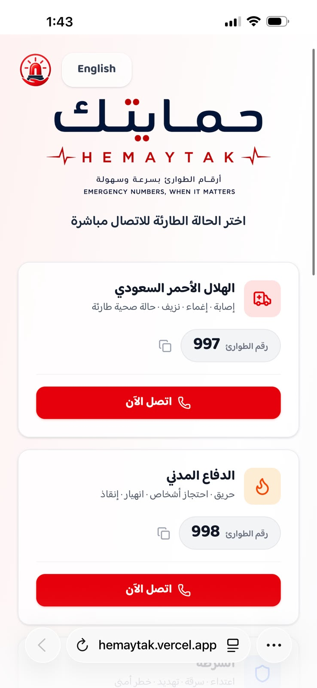
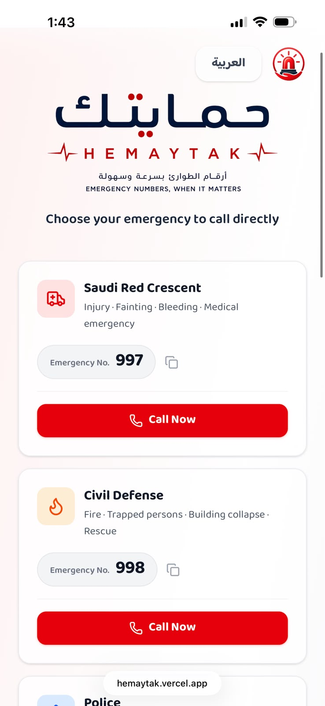
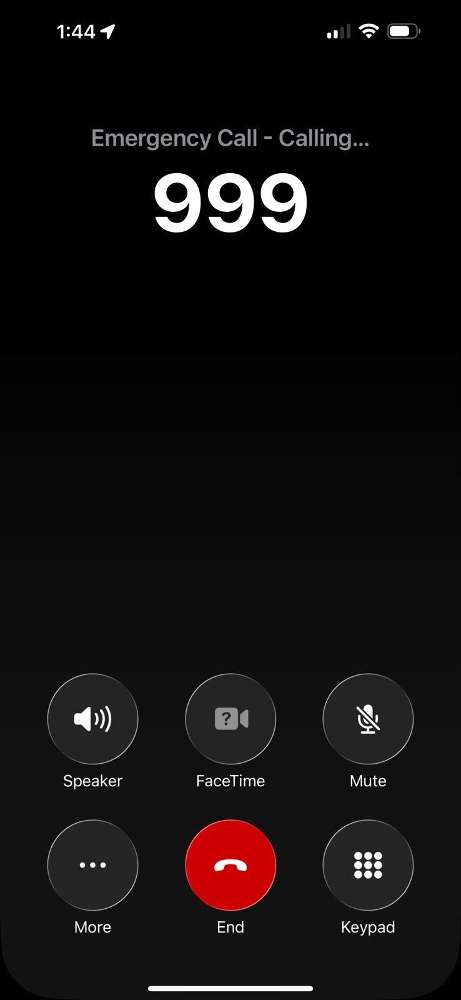
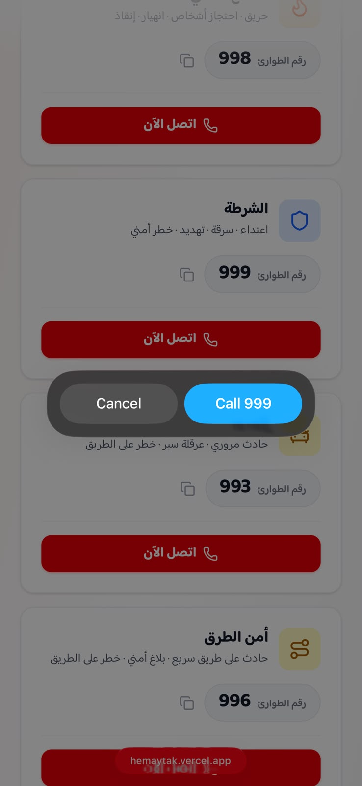

<div align="center">

<table align="center">
  <tr>
    <td align="center" bgcolor="white">
      
    </td>
  </tr>
</table>

# حمايتك | HEMAYTAK

**Emergency numbers, when it matters — one-tap access to Saudi Arabia's emergency services**

**أرقام الطوارئ بسرعة وسهولة — وصول بضغطة واحدة لخدمات الطوارئ في السعودية**

🔗 **Live Demo: [hemaytak.vercel.app](https://hemaytak.vercel.app)**

</div>

---

## 📖 About | نبذة

**Hemaytak** is a lightweight, mobile-first web platform that helps people in Saudi Arabia quickly reach emergency services. It presents emergency situations and authorities through a clear bilingual interface, allowing users to start a call with a single tap — because in an emergency, every second counts.

Hemaytak is designed for **everyone**: citizens and residents, **tourists and visitors** who may not know local emergency numbers, **the elderly** through large readable buttons and clear typography, and **children** who may need to reach help quickly through the dedicated Child Helpline (116111) and a simple, icon-driven interface.

The initial release supports **Arabic and English**. Eight additional languages are planned for Phase Two after translation review for accuracy.

**حمايتك** منصة ويب خفيفة تساعد المستخدمين في السعودية على الوصول السريع إلى أرقام الطوارئ. تعرض الحالات والجهات بواجهة ثنائية اللغة واضحة، وتتيح بدء الاتصال بضغطة واحدة — لأن كل ثانية لها ثمن في الطوارئ.

صُممت حمايتك **للجميع**: المواطنين والمقيمين، **والسياح والزوار** الذين قد لا يعرفون أرقام الطوارئ المحلية، **وكبار السن** عبر أزرار كبيرة وخطوط واضحة سهلة القراءة، **والأطفال** الذين قد يحتاجون المساعدة بسرعة عبر خط مساندة الطفل (116111) وواجهة أيقونية بسيطة.

تدعم النسخة الأولى **العربية والإنجليزية**، مع التخطيط لإضافة ثماني لغات أخرى في المرحلة الثانية بعد مراجعة الترجمات والتأكد من دقتها.

---

## 📸 Screenshots

| Arabic Interface — RTL | English Interface — LTR |
|:---:|:---:|
|  |  |

| Mobile Experience | One-Tap Calling |
|:---:|:---:|
|  |  |

---

## ✨ Features

- 📞 **One-tap calling** — `tel:` links open the phone dialer with the number ready
- 📲 **Installable PWA** — add Hemaytak to the home screen and access essential numbers offline
- 🌐 **Bilingual interface** — Arabic ⇄ English with automatic RTL/LTR switching
- 💾 **Language persistence** — remembers the user's selected language
- 📋 **Copy number** — one-click copy with visual confirmation
- 🎨 **Identity-driven design** — custom branding, authority-specific colors, and clear icons
- 📱 **Mobile-first experience** — designed for the device most likely to be used in an emergency
- 🖐️ **Large touch-friendly buttons** — clear call actions and readable typography
- ♿ **Accessibility-focused** — semantic HTML, ARIA labels, keyboard focus indicators, and screen-reader-friendly structure
- 🗂️ **Data-driven content** — emergency numbers are managed from one JSON file
- 🔒 **Privacy by design** — no accounts, no location tracking, and no personal data collection

> **Offline access:** Essential numbers remain available after the app has loaded successfully at least once. Starting a call still requires cellular service or Wi-Fi Calling.
>
> **الوصول دون إنترنت:** تبقى الأرقام الأساسية متاحة بعد فتح التطبيق بنجاح لأول مرة، لكن إجراء المكالمة يتطلب شبكة جوال أو خدمة Wi-Fi Calling.

---

## 📲 Install Hemaytak on Your Phone | ثبّت حمايتك على جوالك

Hemaytak is an **installable Progressive Web App (PWA)**. It can be added to the home screen and opened like a regular app without downloading it from an app store.

حمايتك يعمل كتطبيق ويب تقدّمي **PWA**، ويمكن تثبيته على الشاشة الرئيسية وفتحه كتطبيق عادي دون الحاجة إلى متجر التطبيقات.

### iPhone or iPad — Safari

| Step | English | العربية |
|---:|---|---|
| 1 | Open [hemaytak.vercel.app](https://hemaytak.vercel.app) in **Safari**. | افتح [hemaytak.vercel.app](https://hemaytak.vercel.app) في متصفح **Safari**. |
| 2 | Tap the **Share** button at the bottom of the screen. | اضغط زر **المشاركة** أسفل الشاشة. |
| 3 | Select **Add to Home Screen**. | اختر **إضافة إلى الشاشة الرئيسية**. |
| 4 | Tap **Add** to complete the installation. | اضغط **إضافة** لإكمال التثبيت. |

### Android — Chrome

| Step | English | العربية |
|---:|---|---|
| 1 | Open [hemaytak.vercel.app](https://hemaytak.vercel.app) in **Chrome**. | افتح [hemaytak.vercel.app](https://hemaytak.vercel.app) في متصفح **Chrome**. |
| 2 | Tap the menu icon **⋮** at the top of the browser. | اضغط أيقونة القائمة **⋮** أعلى المتصفح. |
| 3 | Select **Install app** or **Add to Home screen**. | اختر **تثبيت التطبيق** أو **الإضافة إلى الشاشة الرئيسية**. |
| 4 | Confirm the installation. | أكّد عملية التثبيت. |

> **Quick test:** After installation, open Hemaytak in airplane mode to confirm that the emergency directory is available offline. Calls will not start in airplane mode unless Wi-Fi Calling is available.
>
> **اختبار سريع:** بعد التثبيت، افتح حمايتك في وضع الطيران للتأكد من أن دليل الأرقام يعمل دون إنترنت. لن تبدأ المكالمة في وضع الطيران إلا إذا كانت خدمة Wi-Fi Calling متاحة.

---

## 🛠️ Tech Stack

| Technology | Purpose |
|---|---|
| React 19 + Vite | User interface and build tool |
| Tailwind CSS v4 | Responsive styling |
| react-i18next | Arabic and English internationalization |
| Lucide React | Interface and service icons |
| vite-plugin-pwa | Installation and offline support |
| Vercel | Hosting and continuous deployment |

---

## 📁 Project Structure

```text
HEMAYTAK/
├── screenshots/
│   ├── first_inter_ARB.jpeg
│   ├── first_inter_ENG.jpeg
│   ├── Start_Call.jpeg
│   └── Click_Call.jpeg
├── src/
│   ├── assets/
│   │   └── logo_name.png
│   ├── components/
│   │   ├── Header.jsx
│   │   ├── EmergencyCard.jsx
│   │   ├── LanguageSwitcher.jsx
│   │   └── Footer.jsx
│   ├── data/
│   │   └── emergencyNumbers.json
│   ├── i18n.js
│   ├── App.jsx
│   └── main.jsx
├── package.json
└── README.md
```

---

## 🚀 Run Locally

### Prerequisites

- Node.js 18 or later
- npm

### Installation

```bash
git clone https://github.com/njoudalarfaj/HEMAYTAK.git
cd HEMAYTAK
npm install
npm run dev
```

The local development address will appear in the terminal.

### Production Build

```bash
npm run build
npm run preview
```

---

## 🗺️ Roadmap

- [x] Launch the initial Arabic and English version
- [x] Add installable PWA support with offline access to essential numbers
- [ ] **Phase Two:** add eight reviewed languages — اردو، বাংলা، Filipino، Bahasa Indonesia، Français، Español، 简体中文، Türkçe

---

## 📋 Emergency Number Sources

Emergency numbers and service descriptions are reviewed periodically against official Saudi sources.

**Last reviewed: July 2026**

> Hemaytak is an independent informational project and is not an official government emergency service. Availability and coverage of some services may vary by region.

---

## 🔒 Privacy

Hemaytak is a static, privacy-focused application:

- No user accounts
- No personal information requested
- No location tracking
- No phone numbers stored
- No user activity collected by the application

---

<div align="center">

Built with ❤️ by **[Njoud Alarfaj](https://github.com/njoudalarfaj)**  
Computer Science · Early-Career AI Engineer

</div>
